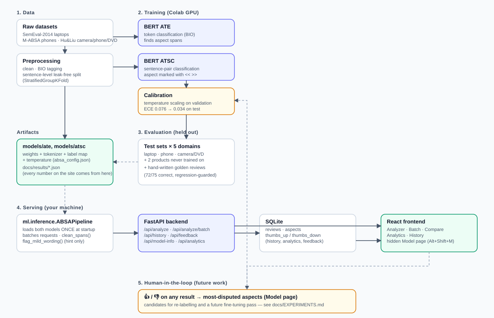

# SmartReview AI

**Multi-Aspect Sentiment Analysis on E-Commerce Product Reviews Using BERT and Machine Learning**

SmartReview AI reads a product review, finds *what* the customer is talking about (aspects such as "battery life"
or "keyboard") and decides *how they feel about each one*.

> "The display is excellent and the keyboard feels comfortable, but the battery drains very quickly."

| Aspect   | Sentiment |
|----------|-----------|
| display  | ✓ Positive |
| keyboard | ✓ Positive |
| battery  | ✕ Negative |

## Problem statement
An overall positive/negative score cannot tell a company *which feature* customers love or complain about.
Aspect-Based Sentiment Analysis (ABSA) provides feature-level feedback.

## Features
- **ATE**: BERT token classification with BIO tags finds aspect terms.
- **ATSC**: BERT sentence-pair classification (`[CLS] review [SEP] aspect [SEP]`) gives Positive / Neutral / Negative with a real softmax confidence.
- Handles mixed-sentiment reviews (each aspect judged separately).
- Web app pages: splash + landing, **Analyzer** (aspect highlighting, per-aspect probability breakdown, one-click demo mode),
  **Batch** (paste or upload up to 50 reviews as .txt/.csv, aggregate report, CSV export), **Compare** (two products side by side, winner per feature),
  **Analytics** (KPIs, click a feature to see its reviews), **History** (search / filter / sort / export CSV / delete / clear), hidden **Model** page (Alt+Shift+M).
- Safeguards so answers stay appropriate: English-only input check (clear message instead of nonsense), an out-of-scope warning for product
  types the models were not tested on, honest **calibrated** confidence (temperature scaling), a "⚠ low confidence" flag, a note when the wording
  is mild ("okay") and could also be read as neutral, and aspect-name clean-up. Each safeguard was measured on held-out data before being kept
  (see `docs/EXPERIMENTS.md`, experiments 4-6), and a hand-written golden-review suite guards the answer quality in the tests.
- **Key takeaways**: plain-English summaries on the Batch and Analytics pages ("customers most often praise ..."), only stated when at least 2 mentions support them.
- **Human-in-the-loop feedback**: 👍/👎 on any saved aspect result; the hidden Model page shows total agreement and the most-disputed
  results — exactly the candidates a real deployment would re-label and fine-tune on next (see `docs/EXPERIMENTS.md`, "future work").
- **PDF report export** on the Batch page: a print-friendly, self-contained report (KPIs, takeaways, full results) opens in a new tab;
  "Save as PDF" from the browser's own print dialog, so no PDF library is bundled.
- **Answer-quality regression guard**: a hand-written set of realistic reviews (`tests/golden_reviews.json`) with expected answers is
  re-checked on every test run (`tests/ml/test_golden.py`) and its live breakdown is shown on the hidden Model page.
- Efficient: batched model inference (about 1.9x faster than one-by-one on CPU, identical results), an LRU result cache, model warm-up at startup,
  and lazy-loaded pages (main JavaScript bundle 713 kB -> 305 kB).
- Accessible UI (sentiment = icon + text + colour), responsive, friendly errors (no stack traces).
- **Continuous integration**: every push runs the backend, ML-utility and frontend test suites (`.github/workflows/ci.yml`) — see
  [Continuous integration](#continuous-integration).

## Architecture
 Colab GPU training -> evaluation -> saved model artifacts -> FastAPI + SQLite + React serving -> feedback loop back into future training" width="100%">

```
Review ─► preprocessing ─► BERT ATE ─► aspects ─► BERT ATSC ─► sentiment + confidence
                                                                   │
React (Vite/TS/Tailwind/Recharts) ◄── FastAPI ◄── ABSA pipeline ◄──┘   SQLite (history, analytics, feedback)
```
| Folder | Purpose |
|---|---|
| `ml/` | preprocessing, BIO tagging, training, evaluation, inference pipeline |
| `backend/` | FastAPI service, SQLAlchemy models, routes |
| `frontend/` | React app |
| `data/` | `raw/` SemEval XML, `processed/` leak-free splits |
| `models/` | trained `ate/` and `atsc/` (weights, tokenizer, labels, logs, test metrics) |
| `tests/` | ML and backend tests (frontend tests live in `frontend/src/__tests__`) |
| `docs/` | `VIVA_PREP.md`, `RUN_GUIDE.md`, `EXPERIMENTS.md` (results), `results/` (raw evaluation JSON) |

## Dataset
| Source | Domain | Use |
|---|---|---|
| SemEval-2014 Task 4 (`Laptop_Train_v2.xml`) | Laptops | train / validation / test (own 80/10/10 split by sentence) |
| M-ABSA, English (`data/raw/mabsa_phone/`) | Phones | train / validation / test (the repository's own splits) |
| Hu & Liu 2004 (`data/raw/hu_liu/`) | Canon camera, Nokia phone, Apex DVD player | train / validation / test (split by review) |
| Hu & Liu 2004 | **Nikon camera, Creative MP3 player** | **never used in training**: tests transfer to unseen products |

None of the datasets is committed. Place the files under `data/raw/` (see `docs/RUN_GUIDE.md`); they are research data, cite the original papers.
The laptop-only statistics (measured by `python -m ml.explore_data`): 3,045 sentences, 2,358 aspect annotations
(positive 987, negative 866, neutral 460, conflict 45); `conflict` is excluded from sentiment training.
The multi-domain build (`python -m ml.preprocessing.prepare_multidomain`) writes `data/processed_md/` and `build_report.json`.

## ML methodology
1. **Cleaning** normalises whitespace and *remaps character offsets* so aspects stay aligned.
2. **Leak-free split**: 80/10/10 by sentence (`StratifiedGroupKFold`, grouped on the sentence text) so one review is never in two splits.
3. **BIO alignment** to BERT subwords: first subword of each word labelled, others `-100`.
4. **Training**: `bert-base-uncased`, AdamW, linear warm-up/decay, best epoch chosen on validation F1 (ATE) / macro-F1 (ATSC). ATSC uses inverse-frequency class weights and **marks the aspect inside the sentence** (`<< battery >>`) so the model knows which mention to judge.
5. **Multi-domain training** on laptops + phones + cameras/DVD, evaluated per domain, including two products never seen in training.
6. **Evaluation** on the held-out test splits: exact and partial span P/R/F1 (ATE); accuracy, macro-F1, per-class metrics, confusion matrix (ATSC).

## Setup
Requirements: Python 3.12/3.13, Node 22+.
```bash
python -m venv venv
venv\Scripts\activate            # Windows   (source venv/bin/activate on macOS/Linux)
pip install -r requirements.txt
cd frontend && npm install && cd ..
```

## Data and training
```bash
python -m ml.explore_data                 # dataset statistics
python -m ml.preprocessing.prepare_data          # laptop-only clean + leak-free split -> data/processed
python -m ml.preprocessing.prepare_multidomain   # laptop + phone + camera/DVD -> data/processed_md
python -m ml.train_ate  --data-dir data/processed_md --epochs 4 --out-dir models/ate
python -m ml.train_atsc --data-dir data/processed_md --mark-aspect --epochs 4 --out-dir models/atsc
python -m ml.eval_cross_domain --name multi_domain --ate models/ate --atsc models/atsc   # -> docs/results/multi_domain.json
python -m ml.make_results_report                 # regenerates docs/EXPERIMENTS.md and the results below
```
A GPU (or Colab, see `notebooks/train_colab.ipynb`) is much faster; CPU works.

## Run the app
Double-click `start_app.bat` for a one-click demo (details in `docs/RUN_GUIDE.md`). The Model page is hidden from the navigation; press **Alt + Shift + M**.

Manually:
```bash
uvicorn backend.app.main:app --reload     # API on http://127.0.0.1:8000  (docs at /docs)
cd frontend && npm run dev                # UI on http://localhost:5173
```

## API
| Method | Path | Purpose |
|---|---|---|
| POST | `/api/analyze` | `{"review": "..."}` → overall sentiment + aspects (text, offsets, sentiment, confidence, class probabilities) |
| POST | `/api/analyze/batch` | `{"reviews": [...up to 50], "save": true}` → per-review results + aggregate summary (batched inference) |
| GET | `/api/history` | list (`search`, `sentiment`, `aspect`, `sort`, `order`, `limit`, `offset`) |
| GET | `/api/history/export` | CSV download (same filters; spreadsheet-formula safe) |
| DELETE | `/api/history` | delete ALL stored analyses |
| GET / DELETE | `/api/history/{id}` | detail / delete |
| GET | `/api/analytics` | KPI counts, top aspects, trend |
| GET | `/api/health` | status, models loaded, device |
| GET | `/api/model-info` | training logs, test metrics, cross-domain comparison, golden-review results |
| POST | `/api/aspects/{id}/feedback` | `{"vote": "up"\|"down"}` → updated thumbs counts (human-in-the-loop) |
| GET | `/api/feedback/summary` | total votes, agreement rate, most-disputed aspects |

Configuration via environment variables prefixed `SMARTREVIEW_` (model dirs, DB URL, max review length, CORS origins).

## Tests
```bash
python -m pytest tests -q          # backend, data, metrics and end-to-end model tests
cd frontend && npm test            # UI tests
```

### Continuous integration
`.github/workflows/ci.yml` runs on every push and pull request: the Python suite (backend API tests + ML utility
tests; the two model-dependent suites, `test_inference.py` and `test_golden.py`, skip automatically because the
~0.9 GB of trained weights are not committed — see `.gitignore`) and the frontend suite (`tsc --noEmit`, `vitest`,
`vite build`). It only runs once this repository is pushed to GitHub (GitHub Actions is a GitHub-hosted feature;
a local-only git repo does not trigger it).

## Results
Results are produced by the evaluation scripts and stored in `models/*/test_metrics.json`; see the section
below (filled from those files, never typed by hand).

<!-- RESULTS:START -->
### Final models (multi-domain) vs laptop-only baseline, on held-out test sets

Model sets: **laptop-only** (trained on SemEval-2014 laptops) vs **multi-domain** (laptops + M-ABSA phones + Hu & Liu cameras/phone/DVD).
Each cell shows *laptop-only → multi-domain*. Sentences/aspects are the test-set sizes.

| Test set | Sentences / aspects | Aspect finding, exact F1 | Aspect finding, partial F1 | Sentiment accuracy | Sentiment macro-F1* |
|---|---|---|---|---|---|
| Laptops (SemEval-2014) | 305 / 213 | 80.0% → **73.2%** (-6.8 pts) | 84.2% → **81.4%** | 79.3% → **81.7%** (+2.3 pts) | 77.5% → **80.1%** |
| Phones (M-ABSA) | 554 / 800 | 43.1% → **57.2%** (+14.1 pts) | 62.7% → **80.5%** | 83.1% → **90.5%** (+7.4 pts) | 68.3% → **77.3%** |
| Camera / phone / DVD (products seen in training) | 44 / 56 | 36.5% → **45.6%** (+9.1 pts) | 53.9% → **66.7%** | 87.5% → **94.6%** (+7.1 pts) | 91.5% → **94.3%** |
| Nikon camera (NEVER seen in training) | 133 / 160 | 39.4% → **53.2%** (+13.7 pts) | 60.3% → **73.7%** | 88.1% → **94.4%** (+6.2 pts) | 85.0% → **90.1%** |
| MP3 player (NEVER seen in training) | 577 / 669 | 43.3% → **46.8%** (+3.6 pts) | 66.9% → **70.8%** | 84.0% → **89.4%** (+5.4 pts) | 87.5% → **90.5%** |

\* macro-F1 over the classes present in that test set (the Hu & Liu data has no *neutral* class).

Training of the final models: ATE best validation F1 0.639; ATSC best validation macro-F1 0.823
(both on a validation set that mixes all domains, so these are not comparable to the laptop-only validation scores).

Full write-up: `docs/EXPERIMENTS.md`.
<!-- RESULTS:END -->

## Limitations
Tested only on laptops, phones, cameras, MP3 and DVD players (not "all products"); aspect finding on non-laptop products is far weaker than on laptops and
laptop aspect-finding dropped after multi-domain training; incomplete annotation in the extra datasets; implicit aspects are missed; sarcasm;
two-stage error propagation; Neutral is the hardest class ("okay" is predicted Positive); odd aspect boundaries ("battery drains");
over-confident probabilities. Details in `docs/EXPERIMENTS.md` and `docs/VIVA_PREP.md`.

## Future work
Use the collected 👍/👎 feedback to build a re-labelling and fine-tuning set (the collection mechanism exists today;
automatically retraining on it does not). More product domains and multilingual data (M-ABSA has 21 languages),
joint end-to-end ABSA, implicit aspects, cloud deployment.

## Team
Team names, roll numbers, guide, institution, academic year, GitHub and contact are shown on the hidden project page
(press **Alt + Shift + M** in the running app). Edit them in one place: `frontend/src/data/project.ts` (replace every `TODO`).
